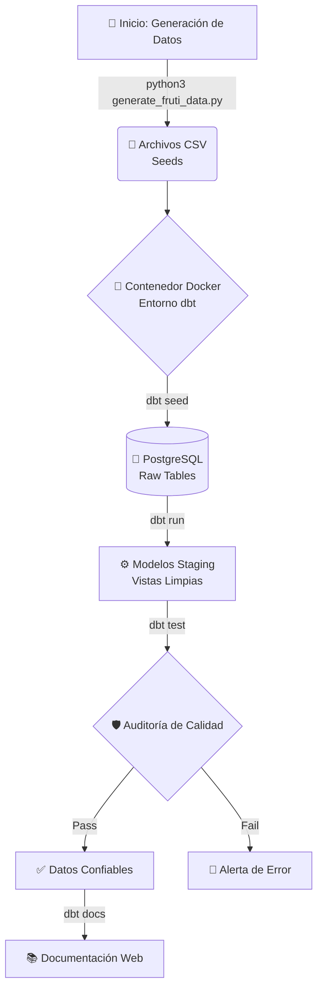

Aquí tienes la versión mejorada y completa del manual. Se ha incorporado el **Gráfico del Pipeline** al inicio y la **Estructura de Carpetas** detallada, integrándolos en la narrativa del laboratorio.

---

# 📘 Guía de Laboratorio: Ingeniería de Datos Moderna con dbt y Docker
## Caso de Estudio: Control de Calidad en "FrutiFresh"

### 🎯 Introducción y Flujo de Trabajo (Pipeline)

En este laboratorio, simularás el ciclo de vida real de un Ingeniero de Datos en la empresa "FrutiFresh". Tu misión es tomar datos caóticos generados por sistemas legacy (simulados con Python), cargarlos, transformarlos y, lo más importante, auditarlos automáticamente.

A continuación, se presenta el **Pipeline de Datos** que construirás. Este gráfico resume la arquitectura y los comandos clave que ejecutarás en cada etapa.



**Resumen de Comandos del Pipeline:**
1.  **Generación:** `python3 generate_fruti_data.py` (Crea datos sucios intencionales).
2.  **Ingesta (Load):** `dbt seed` (Carga los CSV a la base de datos).
3.  **Transformación:** `dbt run` (Crea las vistas y tablas SQL).
4.  **Calidad (Audit):** `dbt test` (Verifica reglas de negocio: duplicados, nulos, etc.).
5.  **Publicación:** `dbt docs generate` + `python server` (Visualización del linaje).

---

### 📂 Estructura del Proyecto

Al finalizar la configuración, tu directorio de trabajo `~/app_dbt` deberá lucir exactamente así. Usa esta estructura como referencia para verificar que has creado los archivos en el lugar correcto.

```text
/home/estudiante/app_dbt/
├── .env                        # Credenciales de la Base de Datos (User/Pass)
├── Dockerfile                  # Receta para construir la imagen de dbt
├── docker-compose.yml          # Orquestador (dbt + Postgres)
├── requirements.txt            # Librerías Python (dbt-postgres, protobuf)
├── generate_fruti_data.py      # Script generador de caos (Python)
├── dbt/                        # Carpeta montada en el contenedor
│   ├── dbt_project.yml         # Configuración principal del proyecto
│   ├── profiles.yml            # Perfil de conexión (Targets)
│   ├── seeds/                  # Aquí caerán los CSVs generados
│   │   ├── frutifresh_products.csv
│   │   └── frutifresh_sales.csv
│   ├── models/
│   │   └── staging/            # Aquí va tu lógica SQL y Tests
│   │       ├── schema.yml      # ¡IMPORTANTE! Aquí se definen los tests
│   │       ├── stg_products.sql
│   │       └── stg_sales.sql
│   ├── tests/
│   ├── macros/
│   └── snapshots/
└── README.md
```

---

### 📋 Requisitos Previos
*   Sistema Operativo Linux (Ubuntu/WSL2).
*   Docker y Docker Compose instalados y corriendo.
*   Conocimientos básicos de SQL y terminal.

---

### 🚀 FASE 1: Infraestructura y Aprovisionamiento

Construiremos el "astillero" antes de lanzar el barco.

#### 1.1. Preparación de Directorios
Abra su terminal y cree el esqueleto del proyecto:

```bash
mkdir -p ~/app_dbt/dbt/seeds ~/app_dbt/dbt/models/staging ~/app_dbt/dbt/macros
cd ~/app_dbt
```

#### 1.2. Definición de Dependencias (`requirements.txt`)
Evitaremos conflictos de versiones ("Dependency Hell") definiendo versiones estrictas.

```bash
nano requirements.txt
```
*Contenido:*
```text
dbt-postgres==1.7.0
protobuf>=4.0.0,<5.0.0
```

#### 1.3. La Imagen de Docker (`Dockerfile`)
Usamos una imagen ligera de Python (Slim-Bullseye) para optimizar recursos.

```bash
nano Dockerfile
```
*Contenido:*
```dockerfile
FROM python:3.9-slim-bullseye
WORKDIR /usr/app/dbt_project

# Instalamos git y herramientas esenciales
RUN apt-get update && apt-get install -y git build-essential && rm -rf /var/lib/apt/lists/*

COPY requirements.txt .
RUN pip install --no-cache-dir -r requirements.txt

COPY dbt/ .
EXPOSE 8080
CMD ["bash"]
```

#### 1.4. Orquestación (`docker-compose.yml`)
Define la relación entre tu código (dbt) y tus datos (Postgres).

```bash
nano docker-compose.yml
```
*Contenido:*
```yaml
version: '3.8'
services:
  dbt:
    build: .
    container_name: dbt_dev_container
    working_dir: /usr/app/dbt_project
    volumes:
      - ./dbt:/usr/app/dbt_project
    stdin_open: true
    tty: true
    depends_on:
      - postgres_db
    env_file:
      - .env
    ports:
      - "8080:8080"

  postgres_db:
    image: postgres:13
    container_name: your_postgres_instance
    environment:
      POSTGRES_DB: ${DBT_PG_DBNAME}
      POSTGRES_USER: ${DBT_PG_USER}
      POSTGRES_PASSWORD: ${DBT_PG_PASSWORD}
    ports:
      - "5432:5432"
    volumes:
      - pgdata:/var/lib/postgresql/data

volumes:
  pgdata:
```

#### 1.5. Seguridad y Credenciales (`.env`)
```bash
nano .env
```
*Contenido:*
```ini
DBT_PG_USER=db_usr
DBT_PG_PASSWORD=Tecsup00
DBT_PG_HOST=postgres_db
DBT_PG_PORT=5432
DBT_PG_DBNAME=db_dbt
```

#### 1.6. Despliegue de Infraestructura
```bash
# --no-cache asegura que se instalen las librerías frescas
docker compose build --no-cache dbt
docker compose up -d
```

---

### ⚙️ FASE 2: Configuración de dbt

#### 2.1. Proyecto (`dbt/dbt_project.yml`)
```bash
nano dbt/dbt_project.yml
```
*Contenido:*
```yaml
name: 'frutifresh_project'
version: '1.0.0'
require-dbt-version: [">=1.7.0", "<1.8.0"]
profile: 'frutifresh_profile'
model-paths: ["models"]
seed-paths: ["seeds"]
test-paths: ["tests"]
macro-paths: ["macros"]

models:
  frutifresh_project:
    staging:
      materialized: view
```

#### 2.2. Perfil (`dbt/profiles.yml`)
```bash
nano dbt/profiles.yml
```
*Contenido:*
```yaml
frutifresh_profile:
  target: dev
  outputs:
    dev:
      type: postgres
      host: "{{ env_var('DBT_PG_HOST') }}"
      port: "{{ env_var('DBT_PG_PORT') | int }}"
      user: "{{ env_var('DBT_PG_USER') }}"
      password: "{{ env_var('DBT_PG_PASSWORD') }}"
      dbname: "{{ env_var('DBT_PG_DBNAME') }}"
      schema: public
      threads: 4
```

#### 2.3. Test de Conexión
```bash
docker exec -it dbt_dev_container bash
dbt debug
# Debe retornar: All checks passed!
exit
```

---

### 💾 FASE 3: Simulación de Datos (Caos)

Simularemos un sistema transaccional con fallas.

#### 3.1. Script Python (`generate_fruti_data.py`)
Cree este archivo en `~/app_dbt/`. Este script genera 1000 ventas, pero inyecta:
*   Duplicidad en IDs de productos.
*   Ventas con IDs nulos.
*   Ventas de productos que no existen.

*(Copie el código Python proporcionado en el ejercicio anterior).*

#### 3.2. Ejecutar Generador
```bash
python3 generate_fruti_data.py
# Verifique que en dbt/seeds/ aparezcan los 2 archivos .csv
```

---

### 🛠️ FASE 4: Ejecución del Pipeline

Todo lo siguiente se ejecuta **DENTRO** del contenedor.

```bash
docker exec -it dbt_dev_container bash
```

#### 4.1. Ingesta (Load)
Cargamos los CSV a PostgreSQL.
```bash
dbt seed
```

#### 4.2. Modelado (Transform)
Cree los modelos SQL en `models/staging/`:

*   **`stg_products.sql`**: `SELECT * FROM {{ ref('frutifresh_products') }}`
*   **`stg_sales.sql`**: `SELECT * FROM {{ ref('frutifresh_sales') }}`

Compile las vistas:
```bash
dbt run
```

#### 4.3. Auditoría de Calidad (Quality)
Defina las reglas en `models/staging/schema.yml`:

```yaml
version: 2
models:
  - name: stg_products
    columns:
      - name: product_id
        tests: [unique, not_null]
  - name: stg_sales
    columns:
      - name: sale_id
        tests: [not_null]
      - name: product_id
        tests:
          - relationships:
              to: ref('stg_products')
              field: product_id
```

**¡El momento de la verdad!** Ejecute el test y capture el resultado.
```bash
dbt test
```
*Debe ver fallos en rojo. Esto es el éxito del laboratorio: ha detectado la data sucia.*

---

### 📚 FASE 5: Documentación

```bash
dbt docs generate
python3 -m http.server 8080 --directory target --bind 0.0.0.0
```
Visite `http://localhost:8080` en su navegador.

---

### 🧠 Análisis Crítico (Preguntas de Evaluación)

Responda en su informe:

1.  **Contenerización:** Explique por qué el comando `dbt run` funciona dentro del contenedor pero fallaría si lo ejecuta directamente en su terminal de Linux sin tener dbt instalado. ¿Qué problema resuelve el archivo `requirements.txt` en un equipo de 10 desarrolladores?
2.  **Estrategia de Seeds:** Usted usó `dbt seed` para cargar 1000 ventas. Si FrutiFresh creciera y tuviera 1 millón de ventas diarias, ¿seguiría siendo `dbt seed` la herramienta correcta? ¿Por qué?
3.  **Gestión de Calidad:** `dbt test` falló debido a la venta #50 (ID nulo). En una arquitectura real, ¿deberíamos corregir ese dato en el CSV, en el SQL de dbt con un `WHERE id IS NOT NULL`, o en el sistema origen que generó el dato? Justifique.
4.  **Trazabilidad:** Mire el gráfico de linaje en la documentación web. Si el equipo de IT cambia el nombre de la columna `price` en el archivo CSV, ¿cómo le ayuda dbt a saber qué reportes financieros dejarán de funcionar?

---

### 📝 Rúbrica de Evaluación (20 Puntos)

| Criterio | Indicadores de Logro | Pts |
| :--- | :--- | :--- |
| **Infraestructura (DevOps)** | - Docker Compose levanta sin errores.<br>- Estructura de carpetas correcta.<br>- Conexión exitosa a BD (`dbt debug` en verde). | **5** |
| **Ingeniería (ELT)** | - Script Python genera los datos.<br>- `dbt seed` carga las tablas.<br>- Modelos SQL usan `{{ ref() }}` correctamente. | **5** |
| **Calidad (Data Quality)** | - Archivo `schema.yml` bien configurado.<br>- **Evidencia de `dbt test` fallando**: Se muestran capturas de los errores de unicidad, nulos e integridad. | **5** |
| **Análisis Crítico** | - Documentación desplegada en puerto 8080.<br>- Respuestas a las 4 preguntas demostrando entendimiento del ciclo de vida del dato y limitaciones de las herramientas. | **5** |

**Total: 20 Puntos**
